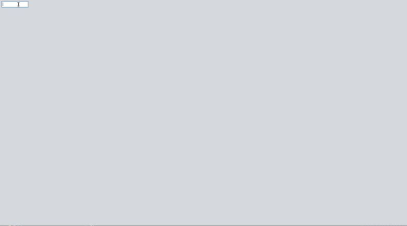
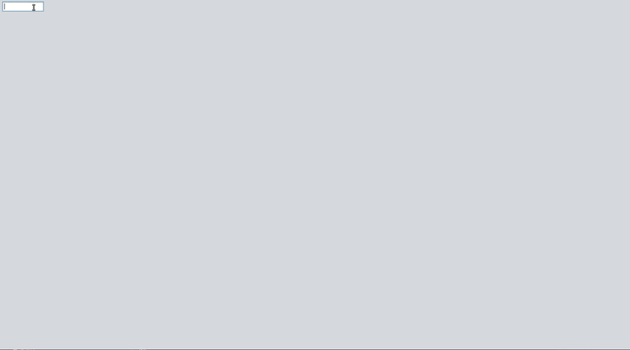
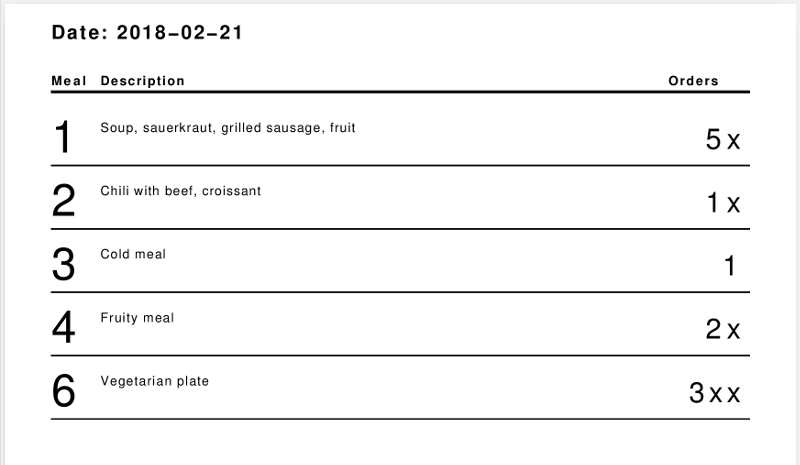
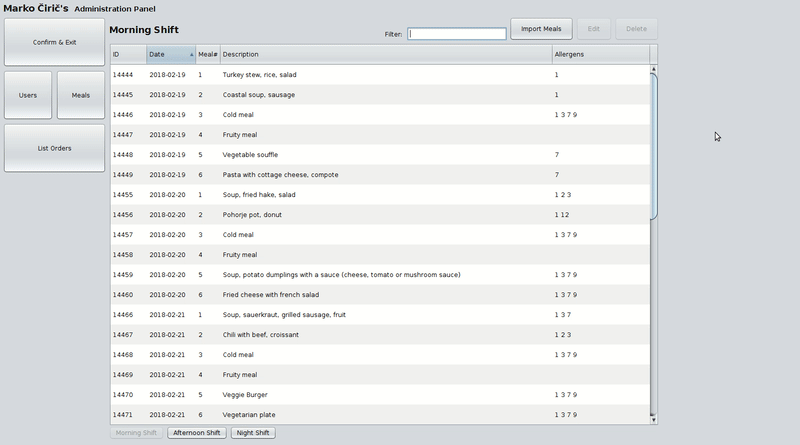
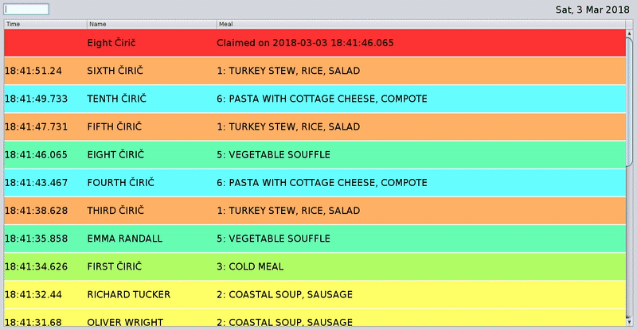

# Meal Ordering Application
A simple application used to order meals as seen in many companies. To start using the application, type number 1 into the password field to login to Administration Panel. Application is currently using ID numbers of users as login credential.

When no meals are ordered a list with set number of items is shown for set days.
List items are not clickable.

Admin panel offers control over users and meals.

To import meals the meal scheme XLSX file needs to be in the pre-defined location and formated correctly.
After the import, meals appear in meals table, and can be browsed by shifts, edited and removed if necessary.

When ordering meals just simply select the item from the list. To remove selection from item simply click the item again.
Before changing the shift views if meals selection changes have been made a prompt asks to save or dismiss changes.

Admin panel offers to view order statistics and print the next days shifts orders, by this action this days shift is disabled and does not accept new orders.

Meals that have orders can be printed showing the count of orders.
(the "x"-es are symbolic and act as placeholders for multi-digit numbers in this example)

Supports table filtering with match highlighter.

Enables a user to claim his ordered meal. The table adds a row with ordered meal data.